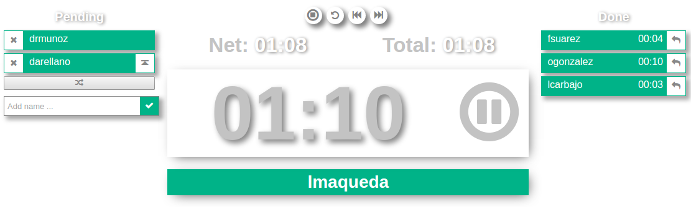

## Synopsis
<!--
At the top of the file there should be a short introduction and/ or
overview that explains **what** the project is. This description should
match descriptions added for package managers
(Gemspec, package.json, etc.)
-->
This project aims to develop a set of tools to support Agile
(more specifically Scrum) activities.

Currently, only a countdown stop watch is provided.

<!--
## Code Example

Show what the library does as concisely as possible, developers should
be able to figure out **how** your project solves their problem by
looking at the code example. Make sure the API you are showing off is
obvious, and that your code is short and concise.
-->

## Motivation
<!--
A short description of the motivation behind the creation and
maintenance of the project. This should explain **why** the project
exists.
-->
The main objective of the project is to create challenges to
[Dart](https://www.dartlang.org/) /
[Dart webdev](https://webdev.dartlang.org/) beginners
(which is my case). That is, in a certain way it is
a motivational project. Nevertheless we will try to make he effort worth
creating useful and handy tools.


## Installation
<!--
Provide code examples and explanations of how to get the project.
-->
Provided that you observe the [LICENSE](LICENSE) you can use
this code in two different ways:

1. Using the components as parts of your own web application. In this
case I take for granted that you know how to use
[Dart webdev](https://webdev.dartlang.org/) comnponents and, therefore,
you should be able to reuse this code by reading the code documentation.
* As a tiny web application. In this case you must perform the
following steps:

    1. Download the code into your machine and then compile it.
    For doing this, as a prerequisite, you will need to have installed
    in your machine [Git](https://git-scm.com/) and
    [Dart SDK](https://www.dartlang.org/tools/sdk).

    ```
    $> git clone https://github.com/giorgio391/scrum_tools.git
    $> cd scrum_tools
    ```


    2. Go into the directory in which you got the code (the one with the
    `pubspec.yaml`) and run the following:

    ```
    $> pub update
    $> pub build
    $> dart bin/server -w!
    ```


    Point you browser to `http://localhost:3000`

## Configuration
### Default stopwatch time per unit
1. Open the file `lib/daily_timer/daily_timer.html`.
2. Edit the attribute `[targetUnitDuration]` of the element `stop-watch`
to express an integer value that will be the number of seconds
to be used.
3. Build the application again by running `pub build` (any previous
configuration done underneath the `build` directory will be
overwritten).
4. Re-start the application.

### List of team members
Edit content in the `build/web/scrum_config.json` JSON file.

<!--
## API Reference

Depeding on the size of the project, if it is small and simple enough
the reference docs can be added to the README. For medium size to
larger projects it is important to at least provide a link to where the
API reference docs live.
-->
<!--
## Tests

Describe and show how to run the tests with code examples.
-->
<!--
## Contributors

Let people know how they can dive into the project, include important
links to things like issue trackers, irc, twitter accounts if
applicable.
-->
## Roadmap
As mentioned before the main objective is to create challenges for
coding in [Dart](https://www.dartlang.org/). Currently I can not plan
about specific periods of time to be devoted to this, but I am willing.
Moreover I am open to start a process to let contributors to get in.
Having said that, who knows where and when this project could get?

## License
<!--
A short snippet describing the license (MIT, Apache, etc.)
-->

This project is released and distributed under the
[MIT](https://opensource.org/licenses/MIT) license model
(please see [LICENSE](LICENSE) as a separate file).
